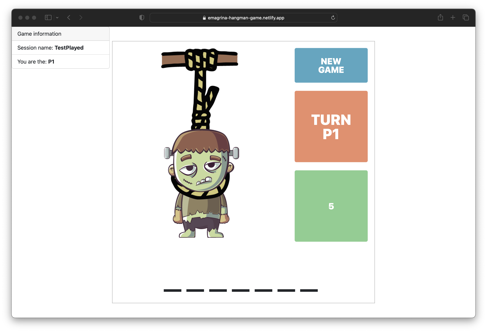

# HangmanGame

>

>
Hangman is a traditional Catalan word and puzzle game played in Catalonia and other parts of Spain. It's also known as "Ahorcado" in other Spanish-speaking countries. The game tests players' wit and vocabulary.

The objective of the game is to guess a hidden word or phrase selected by one player, known as the "game master." The word or phrase is represented by a series of dashes indicating the number of letters and spaces. For example, if the hidden word is "House," it will be displayed as "_ _ _ _ _".

Other players try to guess the word or phrase by suggesting letters one at a time. If the suggested letter is present in the word, the game master reveals its correct position. If the letter is not present, a part of the hangman drawing is added (head, body, arms, legs, etc.). The game continues until players guess the complete word or the hangman drawing is completed.

The challenge lies in guessing the hidden word before the hangman drawing is completed. Players must use their language knowledge, logic, and guessing skills to determine the correct letters and form the right word. As letters are suggested and mistakes are made, the hangman drawing gradually takes shape, adding urgency and excitement to the game.

Hangman is a fun way to test your language skills and reasoning while enjoying time with friends or family. It's a classic game that has been enjoyed for generations and remains popular today.
